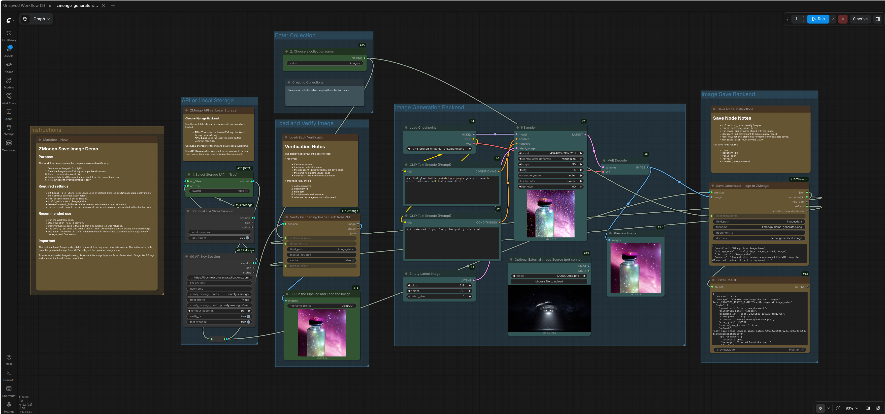
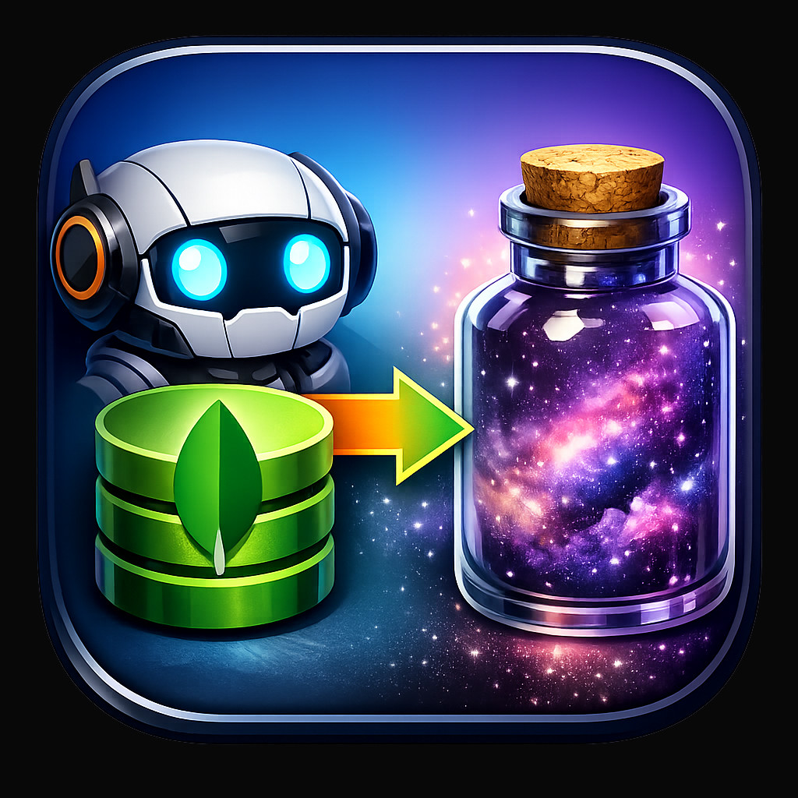

# ComfyUI-ZMongo

[](https://www.python.org/)
[](LICENSE)

**ComfyUI-ZMongo** is a ComfyUI custom node package for saving, loading, browsing, and reusing workflow data through a ZMongo-style storage model.

The project supports two practical storage modes:

1. **Hosted ZMongo API mode** through `https://businessprocessapplications.com`.
2. **Local File Store mode** for private testing and portable local workflows.

Both modes use the same workflow pattern: collections, document IDs, flattened dot-path fields, image fields, metadata fields, saved values, and reloadable workflow assets.


### 🔐 ZMongo API Setup


Create your account, generate an API key, and connect ComfyUI-ZMongo to hosted workflow storage.


[🌐 **Open Business Process Applications** →](https://businessprocessapplications.com)

---

## Quick Links: Official Workflows

| Workflow | Preview | Download |
|---|---|---|
| Generate, Save, Load, and Verify Image | [](example_workflows/zmongo_generate_save_load_image.json) | [`zmongo_generate_save_load_image.json`](example_workflows/zmongo_generate_save_load_image.json) |
| Get / Save Value | [](example_workflows/zmongo_get_save_value.json) | [`zmongo_get_save_value.json`](example_workflows/zmongo_get_save_value.json) |
| Dynamic Preset Features | [](example_workflows/zmongo_preset_features.json) | [`zmongo_preset_features.json`](example_workflows/zmongo_preset_features.json) |

> The workflow screenshots are clickable. Click a screenshot to open/download the matching `.json` workflow.

---

## Table of Contents

1. [Current Status](#current-status)
2. [Installation](#installation)
3. [ZMongo Side Panel and API Key Setup](#zmongo-side-panel-and-api-key-setup)
4. [Node Categories](#node-categories)
5. [Core Concepts](#core-concepts)
6. [Official Example Workflows](#official-example-workflows)
7. [Workflow Instructions](#workflow-instructions)
8. [Local File Store](#local-file-store)
9. [Security Rules](#security-rules)
10. [Troubleshooting](#troubleshooting)
11. [Contributing](#contributing)
12. [License](#license)

---

## Current Status

ComfyUI-ZMongo provides a workflow-data layer for ComfyUI with hosted API support, local file storage, image persistence, prompt/value persistence, flattened dot-path browsing, and dynamic presets.

### Main capabilities

- Save generated or uploaded images to ZMongo-compatible documents.
- Load saved images by `collection_name`, `document_id`, and `field_path`.
- Save and retrieve arbitrary prompt or metadata values.
- Browse collections, list documents, and extract flattened dot-path field names directly inside ComfyUI.
- Use **Dynamic Presets** to turn ComfyUI node settings into reusable workflow logic.
- Save presets by node ID and dynamically rebuild output sockets from loaded preset data.
- Use hosted storage through **BusinessProcessApplications.com** or private local storage through the local file store.
- Use the ZMongo side panel to make API setup easier for end users.

---

## Installation

From the ComfyUI custom nodes directory:

```bash
cd /home/comfyui/comfy_build/ComfyUI/custom_nodes
git clone https://github.com/CentralFloridaAttorney/ComfyUI-ZMongo.git
cd ComfyUI-ZMongo
pip install -r requirements.txt
```

Restart ComfyUI after installation.

For development from the project directory:

```bash
cd /home/comfyui/PycharmProjects/ComfyUI-ZMongo
```

---

## ZMongo Side Panel and API Key Setup

> The ZMongo Side Panel gives users a fast way to connect ComfyUI to hosted ZMongo storage through **BusinessProcessApplications.com**.

The side panel is designed to make API setup approachable for new users while still supporting serious workflow automation. Once connected, workflows can save images, prompts, metadata, presets, documents, and reusable values to hosted ZMongo storage instead of keeping everything trapped inside one local ComfyUI session.

### Why connect an API key?

| Benefit | What it gives you |
|---|---|
| Persistent workflow data | Save images, prompts, presets, metadata, and document values across sessions. |
| Hosted access | Reuse ZMongo data from another ComfyUI install or machine. |
| Cleaner workflows | Manage login/API setup through the side panel instead of hardcoding credentials. |
| Better demos | Share workflows without embedding private API keys. |
| Reusable automation | Store field paths like `image_data`, `prompt.positive`, and preset names for repeatable pipelines. |

### Recommended setup

1. Open the **ZMongo Side Panel** in ComfyUI.
2. Register or sign in through **BusinessProcessApplications.com**.
3. Create or copy your API key.
4. Connect the workflow to hosted ZMongo storage.
5. Save images, prompts, presets, and metadata through the API.

For shared workflows, do **not** type a real API key directly into the workflow. Use the secure environment-variable session pattern:

```bash
export ZAI_API_KEY="your_real_api_key"
export ZTAROT_USERNAME="your_username"
```

Then start ComfyUI from the same shell.

---

## Node Categories

| Category | Purpose | Main Nodes |
|---|---|---|
| `00 Auth` | Create local or hosted sessions. | Local File Store Session, API Key Session, Secure Env API Session, Close API Session. |
| `01 Service` | Backend API checks. | Health, Who Am I. |
| `02 Collections` | Browse and manage collections. | List Collections, Create Collection, Delete Collection. |
| `03 Docs` | Work with core documents and values. | List Docs, Get Doc, Query Docs, Count Docs, Create Doc, Update Doc, Delete Doc, Save Value, Get Value. |
| `04 Images` | Save, display, and discover image documents. | Easy Save Image, Display Image from ZMongo, Browse Collection Images, Debug Image Document, Image Field Candidates, Metadata Flattened Paths. |
| `04 Presets` | Create and hydrate dynamic presets. | Save Preset By Node ID, Load Preset, Dynamic Preset Outputs, Preset Debug Info. |
| `05 Gemini` | Generate AI prompts and structured responses. | Gemini Key Status, Save/Delete/Test Gemini API Key, Gemini Chat, Gemini JSON, List Models, Count Tokens, Prompt from ZMongo Doc, Chat and Save to ZMongo. |
| `06 Documents` | Upload files, create text docs, and run OCR. | Document File Browser, Upload Document File, Create Text Document, Get Document Text, Extract Document Text, Queue Document OCR, Document OCR Status. |
| `07 Image Sequences` | Handle sequential image batches. | Save Image Sequence to ZMongo, Load Image Sequence from ZMongo. |
| `08 Presets/Convenience` | Quick access to standard presets. | KSampler Preset. |
| `09 Discovery` | Inspect ComfyUI node schemas. | Discover Workflow Node Settings, Discover Node Schema. |
| `99 Helpers` | Utility functions for lists and JSON. | Select Nth Item, JSON Pick. |

---

## Core Concepts

### Collections and Documents

A collection is a logical bucket of documents, such as:

```text
images
image_sequences
workflow_presets
```

A document is a single stored record selected by a unique `document_id`.

### Flattened Dot Paths

ComfyUI-ZMongo uses dot-separated paths to save and retrieve nested values.

Examples:

```text
image_data
prompt.positive
metadata.note
workflow.status
```

For image workflows, use the public image field:

```text
image_data
```

Do not use `image_data.data` as the main public field path. That is an internal binary-envelope member.

### Local Storage vs API Storage

Use **Local File Store** when testing workflows privately on one machine.

Use **API Storage** when you want data saved through your hosted Business Process Applications account and available beyond one local ComfyUI install.

### Dynamic Presets

Dynamic presets let a workflow save node settings as named presets, load them later, and rebuild output sockets that can connect back into live ComfyUI nodes.

This allows workflows to switch between settings like:

```text
draft_fast
final_quality
condition_1
condition_2
```

---

## Official Example Workflows

The repository currently includes **three official example workflows**.

Each screenshot below is clickable and opens/downloads the matching workflow JSON when viewed from GitHub or a Markdown renderer that supports relative links.

---

### 1. Generate, Save, Load, and Verify Image

[](example_workflows/zmongo_generate_save_load_image.json)

**Workflow file:** [`example_workflows/zmongo_generate_save_load_image.json`](example_workflows/zmongo_generate_save_load_image.json)  
**Preview image:** [`example_workflows/zmongo_generate_save_load_image.jpg`](example_workflows/zmongo_generate_save_load_image.jpg)

This workflow demonstrates the complete image round trip:

1. Choose **API Storage** or **Local File Store**.
2. Enter or select the target collection, usually `images`.
3. Generate an image in ComfyUI.
4. Save the generated image to ZMongo at `image_data`.
5. Return the saved `document_id`.
6. Load the saved image back from ZMongo.
7. Verify the result with a preview and optional local save.

**Primary workflow groups**

| Group | Purpose |
|---|---|
| `Instructions` | Explains the workflow purpose, required settings, and recommended use. |
| `API or Local Storage` | Switches between hosted ZMongo and local file storage. |
| `Enter Collection` | Sets the target collection name. |
| `Image Generation Backend` | Generates the image using checkpoint, prompt, sampler, latent, and VAE decode nodes. |
| `Image Save Backend` | Saves the generated image to ZMongo. |
| `Load and Verify Image` | Loads the stored image back by document ID and field path. |

**Important settings**

```text
collection_name: images
field_path: image_data
filename: zmongo_demo_generated.png
doc_key: demo_generated_image
```

---

### 2. Get / Save Value Workflow

[](example_workflows/zmongo_get_save_value.json)

**Workflow file:** [`example_workflows/zmongo_get_save_value.json`](example_workflows/zmongo_get_save_value.json)  
**Preview image:** [`example_workflows/zmongo_get_save_value.jpg`](example_workflows/zmongo_get_save_value.jpg)

This workflow demonstrates how to use ZMongo as a reusable prompt and metadata store:

1. Choose **Local File Store** or hosted **API Storage**.
2. List available collections.
3. Select a collection by index.
4. Upload or save an image into a new or existing document.
5. List document IDs.
6. Select a document ID.
7. Load the saved image from the selected document.
8. Save a text value, such as a positive prompt, to a dot-path field.
9. List flattened field paths.
10. Select a field path.
11. Get the saved value and preview it.

**Primary workflow groups**

| Group | Purpose |
|---|---|
| `Select Local or API Storage` | Provides the session used by all ZMongo nodes. |
| `Select Collection` | Lists collections and selects one by index. |
| `Create new Record using an Image` | Saves an uploaded image into a new or selected document. |
| `Select document_id` | Lists and selects stored documents. |
| `Load Image` | Loads the image from `image_data`. |
| `Save Value to Positive Prompt` | Saves prompt text to a metadata field. |
| `Select Value Field Path` | Lists and selects flattened dot-path fields. |
| `Get Value of positive.prompt` | Retrieves the saved prompt value. |

**Important settings**

```text
image field_path: image_data
example value field_path: prompt.positive
example value: A real life photograph of Scooby Doo and Shaggy! There are the Scooby Snacks?
```

---

### 3. Dynamic Preset Features Workflow

[](example_workflows/zmongo_preset_features.json)

**Workflow file:** [`example_workflows/zmongo_preset_features.json`](example_workflows/zmongo_preset_features.json)  
**Preview image:** [`example_workflows/zmongo_preset_features.jpg`](example_workflows/zmongo_preset_features.jpg)

This workflow demonstrates dynamic preset storage for ComfyUI node settings. It saves KSampler settings as named presets, loads the selected preset, rebuilds dynamic output sockets, and applies the saved values back into the workflow.

The example uses a text condition to choose between preset names:

```text
condition_1
condition_2
```

The included condition check searches for the word:

```text
many
```

This allows a workflow to choose different settings based on plain text, such as switching from a fast render preset to a higher-step preset.

**Primary workflow groups**

| Group | Purpose |
|---|---|
| `0. Choose API or Local Storage` | Selects local or hosted preset storage. |
| `1. Switch Conditions` | Parses text and switches between preset names. |
| `2. Set KSampler Values for each Condition` | Saves and loads KSampler settings. |
| `Backend` | Contains the checkpoint, prompts, sampler, latent, and VAE decode chain. |
| `3. Final Actions` | Loads the preset, previews save/load results, and generates with the selected preset. |

**Preset workflow nodes**

| Node | Purpose |
|---|---|
| `ZMongoSavePresetByNodeID` | Saves the selected node's widget/input values as a named preset. |
| `ZMongoLoadPreset` | Loads a saved preset by name. |
| `ZMongoDynamicPresetOutputs` | Rebuilds usable dynamic outputs from the saved preset. |
| `ComfySwitchNode` | Selects one preset name or another based on the parsed condition. |
| `StringContains` | Checks whether the condition text contains the trigger word. |

**Important settings**

```text
preset collection: workflow_presets
example preset names: condition_1, condition_2
target node example: KSampler
example condition word: many
```

---

## Workflow Instructions

### Workflow 1: Generate, Save, Load, and Verify Image

Use this workflow when you want to prove the full ZMongo image loop works.

#### Run order

1. Open `zmongo_generate_save_load_image.json`.
2. Choose storage mode:
   - `API = False` for Local File Store.
   - `API = True` for hosted ZMongo API.
3. Set the collection name, normally:

   ```text
   images
   ```

4. Run the image-generation section.
5. Run **Save Generated Image to ZMongo**.
6. Inspect **JSON Result** and confirm:

   ```text
   success: true
   document_id: present
   ```

7. Run **Verify by Loading Image Back from ZMongo**.
8. Confirm the loaded image matches the generated image.

#### Expected result

The workflow should create or update a document with this public field:

```text
image_data
```

The loaded image should appear through the ZMongo display node.

---

### Workflow 2: Get / Save Value

Use this workflow when you want to save and retrieve prompt text, metadata, tags, review notes, or any other simple document value.

#### Run order

1. Open `zmongo_get_save_value.json`.
2. Choose Local File Store or hosted API storage.
3. Run **List Collections**.
4. Use **Select Collection Index** to pick the target collection.
5. Choose or create a document.
6. Use **Set Value to Save** to enter text.
7. Save the text to:

   ```text
   prompt.positive
   ```

8. Run **List Field Paths**.
9. Use **Select Field Path Index** to choose the saved field.
10. Run **Get Value**.
11. Confirm the retrieved value matches the saved value.

#### Expected result

The selected document should contain a stored value like:

```json
{
  "prompt": {
    "positive": "A saved prompt or metadata value."
  }
}
```

---

### Workflow 3: Dynamic Preset Features

Use this workflow when you want ComfyUI node settings to become reusable presets.

#### Run order

1. Open `zmongo_preset_features.json`.
2. Choose Local File Store or API storage.
3. Enter condition text.
4. Use the `StringContains` node to test for the word:

   ```text
   many
   ```

5. Save one preset as:

   ```text
   condition_1
   ```

6. Change the target KSampler values.
7. Save another preset as:

   ```text
   condition_2
   ```

8. Run **Load Preset**.
9. Run **Dynamic Preset Outputs**.
10. Connect dynamic outputs to matching target node inputs where needed.
11. Generate the image.

#### Expected result

The workflow should switch between saved KSampler settings based on condition text.

Example:

```text
"render steps"       -> condition_1
"render many steps"  -> condition_2
```

---

## Local File Store

`00 Local File Store Session` is intended for offline/private testing and should use the actual local file store backend.

The local file store should support the same ZMongo-style operations used by the normal API session:

```text
list_collections
create_collection
delete_collection
list_docs
get_doc
query_docs
count_docs
create_doc
update_doc
delete_doc
save_value
fetch_image_field
```

Expected local storage structure:

```text
ComfyUI-ZMongo/local_store/
  manifest.json
  collections/
    images/
      local_....document.json
    workflow_presehttps://businessprocessapplications.com.ts/
      local_....document.json
```

### Recommended local test

Use `zmongo_generate_save_load_image.json` first.

If the local store is working, the workflow should:

1. Save a generated image into `local_store/collections/images/`.
2. Return a `document_id`.
3. Load the image back from the same document.
4. Show the verified image in the workflow.

---

## Security Rules

Do **not** type a real API key into a workflow that will be shared, published, or committed to Git.

ComfyUI saves widget values into workflow JSON. If a session node exposes an API key or username as a visible widget, those values can be serialized into the workflow file.

For public workflows, use the secure environment-variable session node:

```text
00 Secure Env API Session
```

Use the manual API key node only for private debugging.

---

## Troubleshooting

### Authentication fails

Confirm your username, API key, and `comfy_zmongo_prefix`.

Recommended prefix:

```text
/comfy-zmongo
```

If issues persist, use the ZMongo sidebar panel to re-authenticate and copy a fresh key.

### API key appears in workflow JSON

Use `00 Secure Env API Session` instead of entering credentials into visible widgets. Remove any saved secrets from existing workflows before publishing.

### Local File Store does not save

Check that the workflow uses:

```text
00 Local File Store Session
```

Then check for files under:

```text
ComfyUI-ZMongo/local_store/collections/
```

If nothing is created, confirm the installed node file is the updated version where `00 Local File Store Session` uses the actual `LocalFileStore` backend.

### Field path save fails

Ensure you are using a writable path such as:

```text
prompt.positive
metadata.note
image_data
```

Do not write to protected identity fields like:

```text
_id
document_id
created_at
username
owner
```

### Workflow image does not show in README

Make sure the image path and workflow path match exactly:

```text
example_workflows/zmongo_generate_save_load_image.jpg
example_workflows/zmongo_generate_save_load_image.json
```

Linux paths are case-sensitive.

---

## Contributing

- Fork the repository and submit pull requests for bug fixes or new nodes.
- Follow the node category naming convention: `ZMongo/XX Category`.
- Add workflow screenshots and clickable workflow links for new example workflows.
- Do not commit real API keys, usernames, or private backend credentials.

---

## License

This project is licensed under the MIT License. See [LICENSE](LICENSE) for details.
